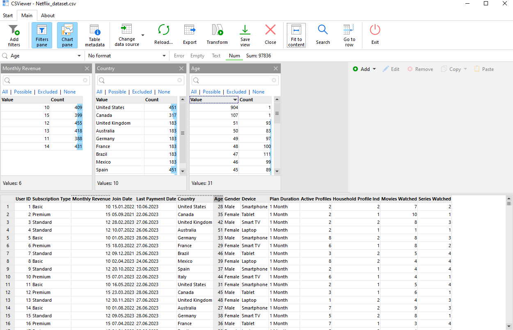
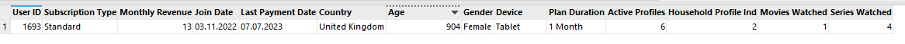

<!-- PROJECT LOGO -->
 

    
  <h3 align="center">Data Engineer Candidate</h3>
  

   Data Engineer Take Home Task Assignment
  

## Assignment:
1. Construct a **normalized** data model for the dataset provided.
2. Load the data into the data model you constructed and into DB engines like
MySQL/SQLite/Postgres or some free online one using the ELT approach (Extra points if you
use Python and SQL in combination to achieve this task). How would you make such loading  repeatable on a regular basis?
3. What control measures could be deployed here to ensure the correctness of data?  Do
you notice something odd about the dataset provided?
4. Write queries for answering the following questions:
- The most profitable country for Netflix
- The most popular packages per country.
- Which country has the potential for improving earnings if Netflix starts charging subscribers
an additional fee for sharing Netflix households outside of their own?
- A report showing the popularity of Movies and Series in different customer segments and
the device used to consume, across the different markets the company operates in.

 Additionally, **extra points** are awarded if you bring out the reasons for your choices.

# Let's get the extra points then:
## Constructing Data Models
This section outlines the data models constructed for the project, focusing on organizing and managing user and 
subscription information efficiently.

Hit that green button in `main.py` and deploy the `inbank_local.db`. 

<h6 align="left">PS. I've also created an additional dataset `Netflix_dataset_with_more_errors.csv` to test validations more precise.</h6>
I decided to use [CSViewer](https://csviewer.com/) to examine the data externally, beyond the confines of the IDE (PyCharm).

    

### 1. Users Data Model
**Description:**  
This model stores basic information about users, including their demographic details. It is essential for 
personalizing user experiences and managing access controls.

**Columns:**

- `user_id`: Unique identifier for the user.
- `age`: The age of the user.
- `gender`: The gender of the user.
- `country`: The country where the user is located.

**Relationships:**

- Primary Key: `user_id`
- Foreign Key Relationships: `user_id` is used as a foreign key in the `subscriptions`, `user_devices`,
`viewing_activity`, and `profiles` tables to link to specific users.

### 2. Subscription Data Model

**Description:**  
This model holds information about users' subscription types, the revenue from each subscription, and related dates. 
It's crucial for tracking subscription metrics and financial forecasting.

**Columns:**

- `subscription_id`: Unique identifier for the subscription record.
- `user_id`: Identifier for the user this subscription belongs to.
- `subscription_type`: Type of subscription (Basic, Premium, Standard).
- `monthly_revenue`: Revenue generated from this subscription on a monthly basis.
- `join_date`: When the user joined Netflix.
- `last_payment_date`: The date of the last payment.
- `plan_duration`: Duration of the subscription plan.

**Relationships:**

- Primary Key: `subscription_id`
- Foreign Key: `user_id` references users.user_id

### 3. Devices Table

**Description:**  
Contains a list of devices that can be used to watch content.

**Columns:**

- `device_id`: Unique identifier for the device.
- `device_name`: The name of the device (e.g., Smartphone, Laptop).

**Relationships:**

- Primary Key: `device_id`
- No direct foreign key relationships, but `device_id` is referenced in `user_devices` to link devices with users.

### 4. User Devices Table

**Description:**  
Maps between users and their devices, allowing for a many-to-many relationship.

**Columns:**

- `user_id`: Identifier for the user.
- `device_id`: Identifier for the device.

**Relationships:**

- Primary Key: Composite key (`user_id`, `device_id`)
- Foreign Keys:
    - `user_id` references `users.user_id`
    - `device_id` references `devices.device_id`

### 5. Viewing Activity Table

**Description:**  
Tracks the number of movies and series watched by each user.

**Columns:**

- `user_id`: Identifier for the user.
- `movies_watched`: The number of movies watched.
- `series_watched`: The number of series watched.

**Relationships:**

- Primary Key: `user_id`
- Foreign Key: `user_id` references `users.user_id`

### 6. Profiles Table

**Description:**  
Stores information about the number of active profiles per user and their household sharing indication.

**Columns:**

- `user_id`: Identifier for the user.
- `active_profiles`: Number of active profiles for the user.
- `household_profile_ind`: Indicator of household profile sharing.

**Relationships:**

- Primary Key: `user_id`
- Foreign Key: `user_id` references `users.user_id`

### Relationships Overview

- Users are central to the database schema, with their `user_id` linking to subscription details, devices used, 
viewing activity, and profile information.
- The subscriptions, viewing_activity, and profiles tables each have a straightforward one-to-one relationship 
with users based on `user_id`.
- The `user_devices` table enables a many-to-many relationship between users and devices, indicating that users 
can have multiple devices and a single device can be used by multiple users.
- Devices serve as a lookup table for device types without directly storing user-specific information.

## Loading Data into Database

For the task of loading data into the database, I decided for a combination of Python and SQL,
leveraging the built-in `sqlite3` library in Python. This choice was motivated by the desire to minimize
the overall footprint of the interpreter and to optimize the speed of data insertion.

### Making the Process Repeatable

To ensure the repeatability of this data loading process, I have developed a script named `bonus.py`. 
It shows how the process can be automated and scheduled without the need for  installing additional tools, 
assuming access to a valid Prefect account. Same can be achieved with other scheduling tools such as Apache Airflow or 
Luigi and many more.

## Data Correctness Control Measures

To ensure the integrity and correctness of data, I've implemented a series of control measures. These include:

- **Age Validations:** Verify that age values are within a realistic range (e.g., 0-130). Note: The oldest person was 
Jeanne Calment with age of **122 years, 164 days**.
- **Data Type Checks:** Ensure each CSV column conforms to its expected data type.
- **Uniqueness and Consistency:** Ensure unique fields remain unique and related data across tables is consistent.
### Addressing Data Oddities

As an example: an unusual finding was a user with an age of 904, which is clearly incorrect. This highlights the need for:

    

- **Robust Validation Rules:** Strengthen validation to catch such outliers.
- **Error Logging:** Log errors for review and correction.
- **Data Cleaning:** Automate the correction of common errors where feasible.

### Queries
All my solutions to the 4 questions in SQL can be found in a script named `sql_queries/answers.py`

For more detailed information, check [sql_answers_details.md](sql_answers_details.md).

## Thank you for reviewing this project.
PS. Would like to meet the person checking this project in person to answer all the questions.

### Contact

Ildar Shagidullin +372 5323 6685 - ildar.shagidullin@gmail.com | plavki.i.ribalka.nesovmestimi@gmail.com